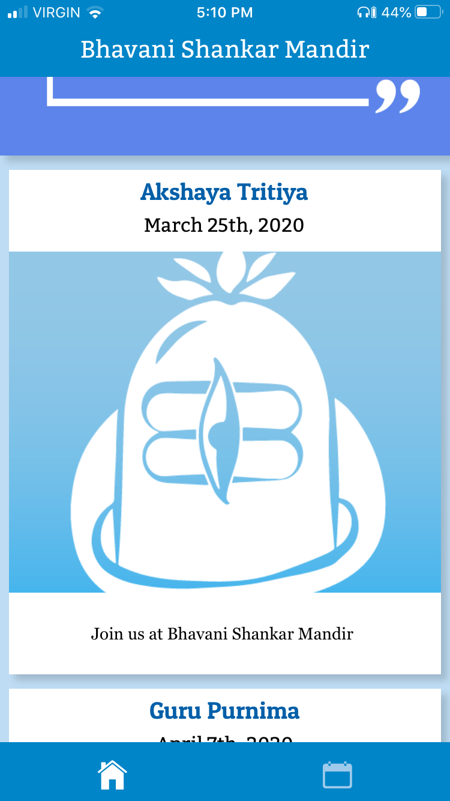
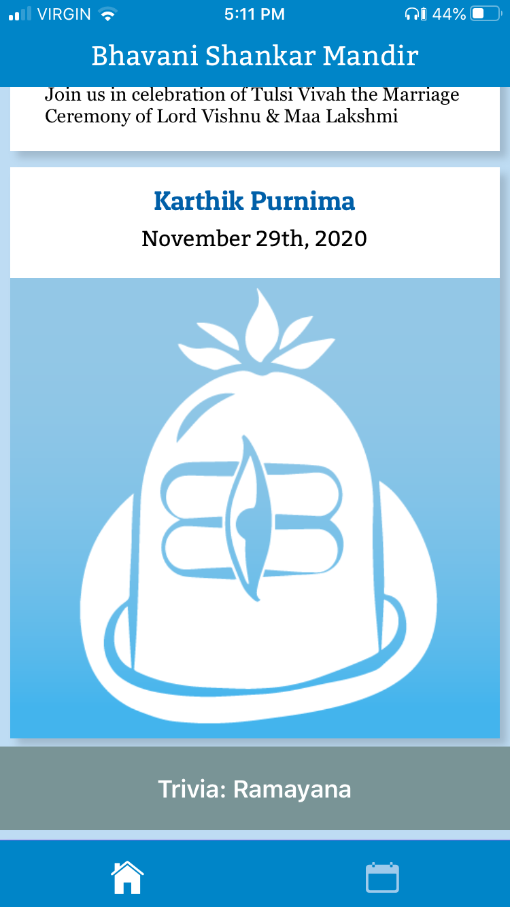
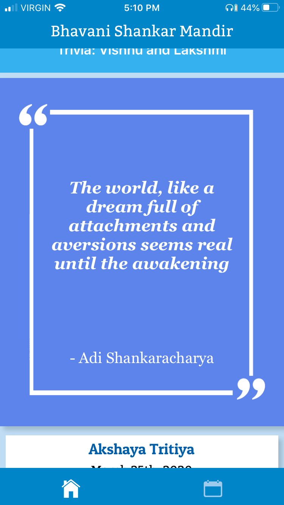
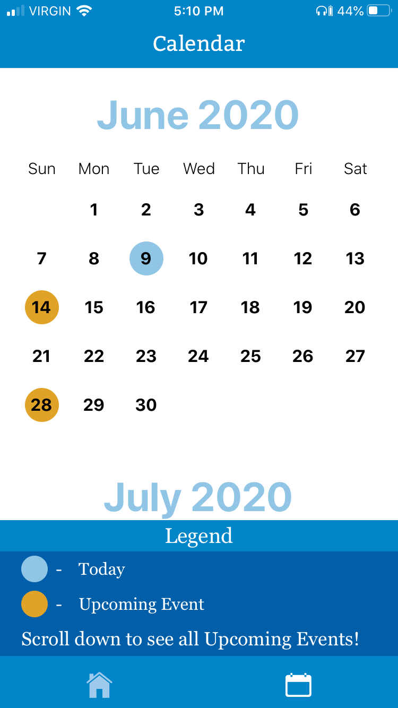

# bsmAppNew

  visual video (updated, June 09, 2020)
 https://youtu.be/rFsyu17SKRQ

 jun 9:  added quote box, Calendar legend, modified header font, colours. increased size of Event box & fonts, cleaned up firebase backend.
 jun 2:  added splash screen, dynamic feed, patuaOne font, calendar designs 
 may 29: added advanced scrolling feature, splash screen, improved firebase interactions, made event dynamic
 may 26: added visuals, Events page, Calendar Screen (edit:vertical), trivia box
  
Home Screen w/ Events Page: 
 

Upcoming Event box (w/ description and without): 
 
 

 Quote box:
  

 Trivia Sections:
  

Event Page Scrolling (outdated, see full video update):
 https://youtu.be/jcV7yBG85NM

 Calendar Screen (vertical with legend):
 
  
 Calendar screen with Vertical scroll, Firebase events, and Events page interaction
 https://youtu.be/7NdCsXegmlo

