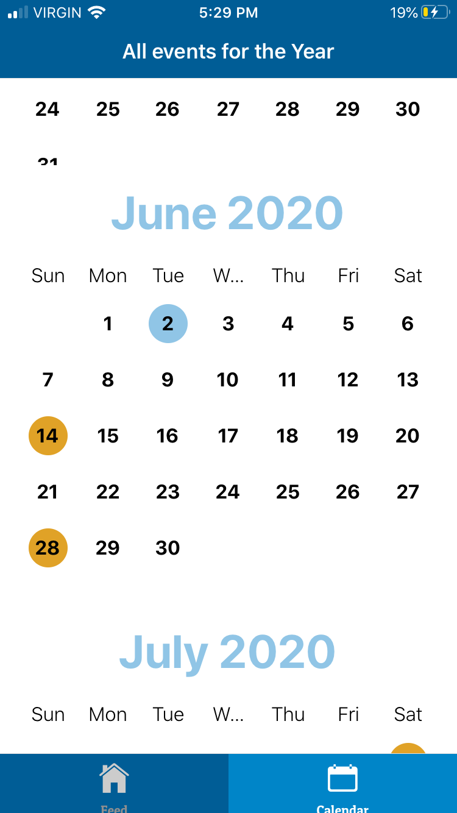

# bsmAppNew

  visual video (updated, June 02, 2020)
 https://youtu.be/KGy42OnouJA

jun 2:  added splash screen, dynamic feed, patuaOne font, calendar designs 
may 29: added advanced scrolling feature, splash screen, improved firebase interactions, made event dynamic
may 26: added visuals, Events page, Calendar Screen (edit:vertical), trivia box
  
Home Screen w/ Events Page: 
 

 Trivia Sections:
  

Event Page Scrolling:
 https://youtu.be/jcV7yBG85NM

 Calendar Screen (vertical):
 
  
 Calendar screen with Vertical scroll, Firebase events, and Events page interaction
 https://youtu.be/7NdCsXegmlo

